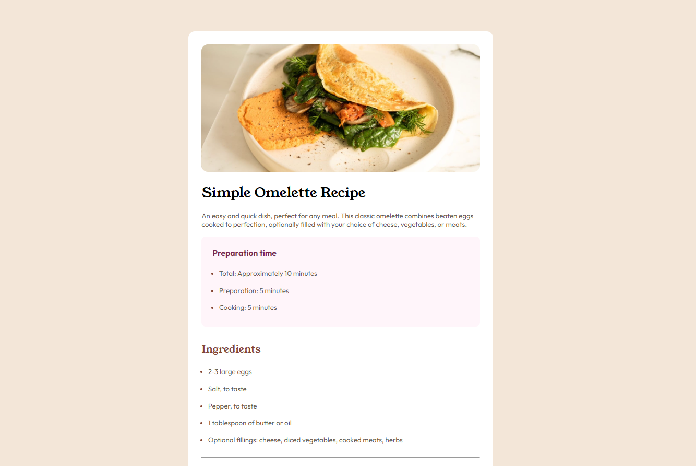

# Frontend Mentor - Recipe page solution

This is a solution to the [Recipe page challenge on Frontend Mentor](https://www.frontendmentor.io/challenges/recipe-page-KiTsR8QQKm). Frontend Mentor challenges help you improve your coding skills by building realistic projects. 

## Table of contents

- [Overview](#overview)
  - [The challenge](#the-challenge)
  - [Screenshot](#screenshot)
  - [Links](#links)
- [My process](#my-process)
  - [Built with](#built-with)
  - [What I learned](#what-i-learned)
  - [Continued development](#continued-development)
  - [Useful resources](#useful-resources)
- [Author](#author)
- [Acknowledgments](#acknowledgments)

## Overview

### Screenshot

### Links

- Solution URL: [Add solution URL here](https://github.com/joaopedro-azevedo/recipe-page-main-frontEndMentor)
- Live Site URL: [Add live site URL here](https://joaopedro-azevedo.github.io/recipe-page-main-frontEndMentor/)

## My process

### What I learned

I used this challenge for training more HTML and CSS basics concepts, like style tables, lists and other basics tags

## Author

- Website - [João Pedro de Azevedo Santos](https://github.com/joaopedro-azevedo)
- Frontend Mentor - [@joaopedro-azevedo](https://www.frontendmentor.io/profile/joaopedro-azevedo)
